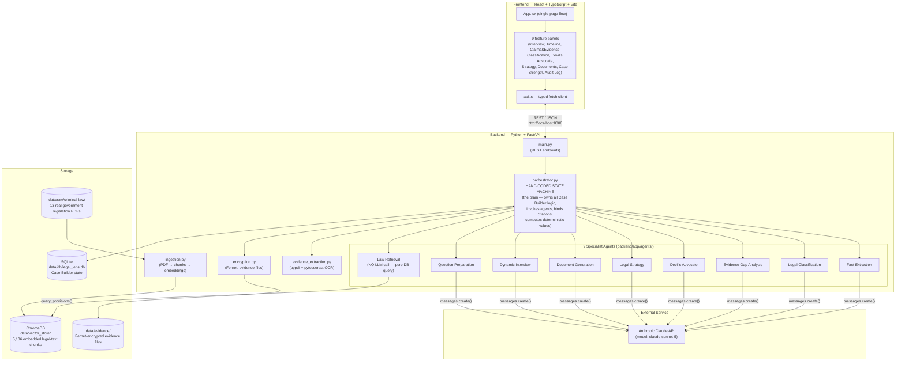

# Legal Lens — Complete Project Explanation

> **Purpose of this document:** this is the single file to read before presenting Legal Lens as a semester-end project. It covers, for **every file that exists in the repository**: what it is, why it exists, what it does internally, and every parameter/constant/threshold a person would need to know to say "I built this" convincingly in a viva. Read top to bottom once, then use the Table of Contents to jump back to any file during Q&A.

---

## Table of Contents

1. [What Legal Lens Is, In One Paragraph](#1-what-legal-lens-is-in-one-paragraph)
2. [System Architecture Diagram](#2-system-architecture-diagram)
3. [Complete File Tree](#3-complete-file-tree)
4. [Root-Level Documents](#4-root-level-documents)
5. [Backend — Configuration & Infrastructure](#5-backend--configuration--infrastructure)
6. [Backend — Database Models (the Case Builder schema)](#6-backend--database-models-the-case-builder-schema)
7. [Backend — The Orchestrator (the brain)](#7-backend--the-orchestrator-the-brain)
8. [Backend — The 9 AI Agents](#8-backend--the-9-ai-agents)
9. [Backend — The RAG / Legal Knowledge Pipeline](#9-backend--the-rag--legal-knowledge-pipeline)
10. [Backend — Evidence Handling & Encryption](#10-backend--evidence-handling--encryption)
11. [Backend — API Layer (main.py)](#11-backend--api-layer-mainpy)
12. [Backend — Test Suite](#12-backend--test-suite)
13. [Data Directory](#13-data-directory)
14. [Frontend](#14-frontend)
15. [Every Important Constant / Hyperparameter, In One Table](#15-every-important-constant--hyperparameter-in-one-table)
16. [Key Design Decisions & The Reasoning Behind Them](#16-key-design-decisions--the-reasoning-behind-them)
17. [Known Limitations — Deliberately Left Incomplete](#17-known-limitations--deliberately-left-incomplete)
18. [How To Run This Project](#18-how-to-run-this-project)
19. [Viva / Presentation Cheat Sheet (Q&A prep)](#19-viva--presentation-cheat-sheet-qa-prep)

---

## 1. What Legal Lens Is, In One Paragraph

Legal Lens is an AI-assisted **legal case-preparation and orientation platform** for people facing a legal situation in **criminal law, under Karnataka/Indian jurisdiction**, who don't necessarily know any legal terminology. It is explicitly **not** a lawyer-replacement — it does not give legal advice, predict outcomes, or file anything. Instead it takes a person's plain-language narrative, extracts structured facts from it, asks follow-up questions, classifies which legal categories might apply, retrieves the *actual* relevant statute sections from a real ingested legal corpus (never inventing citations), finds weaknesses in the case ("devil's advocate"), suggests possible next steps, drafts documents (complaints, notices, chronologies), and presents an honest, multi-dimensional "case strength" summary — never a single win-probability number. Every legal claim shown to the user must trace back to a real retrieved chunk from real government legislation PDFs that were downloaded and ingested into a vector database; the system is built around the principle that it is better to say "I don't know" than to fabricate a confident-sounding but wrong answer.

It is a **portfolio project** (not a production system), built to demonstrate multi-agent system design, RAG (Retrieval-Augmented Generation) pipeline construction, and disciplined engineering trade-off decisions — not to serve real users with real legal problems.

---

## 2. System Architecture Diagram



**In words, one request's journey (e.g. "submit narrative"):**
`Browser → api.ts → POST /cases/{id}/narrative → main.py → Orchestrator.submit_narrative() → FactExtractionAgent.run() → Anthropic Claude API → JSON parsed → Statement/Event rows written to SQLite → AuditLogEntry written → jurisdiction-mismatch keyword check → response returned as JSON → api.ts → React state update → UI re-renders`.

---

## 3. Complete File Tree

```
LegalLens/
├── CLAUDE.md                          ← master planning/decision-log document (huge, living doc)
├── COMPLETION.md                      ← phase-by-phase task tracker (what's done, what's deferred, why)
├── explanation.md                     ← THIS FILE
│
├── backend/                           ← Python + FastAPI backend
│   ├── pyproject.toml                 ← dependency list, project metadata
│   ├── app/
│   │   ├── __init__.py
│   │   ├── main.py                    ← FastAPI app, all REST endpoints
│   │   ├── config.py                  ← Settings (env vars, defaults)
│   │   ├── db.py                      ← SQLAlchemy engine/session setup
│   │   ├── models.py                  ← ORM models = the "Case Builder" schema
│   │   ├── orchestrator.py            ← THE BRAIN: hand-coded state machine
│   │   ├── vector_store.py            ← ChromaDB wrapper (embed/query)
│   │   ├── ingestion.py               ← PDF → text → chunks → ChromaDB pipeline
│   │   ├── evidence_extraction.py     ← OCR/PDF text extraction for uploaded evidence
│   │   ├── encryption.py              ← Fernet encryption for evidence files
│   │   └── agents/
│   │       ├── __init__.py
│   │       ├── base.py                ← Agent abstract base class, Claude API call helpers
│   │       ├── fact_extraction.py     ← Agent 1
│   │       ├── legal_classification.py← Agent 2
│   │       ├── law_retrieval.py       ← Agent 3 (no LLM — pure retrieval)
│   │       ├── evidence_gap_analysis.py← Agent 4
│   │       ├── devils_advocate.py     ← Agent 5
│   │       ├── legal_strategy.py      ← Agent 6
│   │       ├── document_generation.py ← Agent 7
│   │       ├── dynamic_interview.py   ← Agent 8
│   │       └── question_preparation.py← Agent 9
│   └── tests/                         ← 79 automated tests across 21 files
│       ├── conftest.py                ← isolated in-memory test DB setup
│       ├── test_health.py
│       ├── test_ingestion.py
│       ├── test_ingestion_change_detection.py
│       ├── test_retrieval_accuracy.py     ← runs against the REAL ingested corpus
│       ├── test_citation_accuracy.py      ← runs against the REAL ingested corpus
│       ├── test_jurisdiction.py
│       ├── test_fact_extraction_retry.py
│       ├── test_legal_classification_retry.py
│       ├── test_evidence_upload.py
│       ├── test_evidence_gap_analysis.py
│       ├── test_evidence_dispute.py
│       ├── test_encryption.py
│       ├── test_devils_advocate.py
│       ├── test_legal_strategy.py
│       ├── test_document_generation.py
│       ├── test_dynamic_interview.py
│       ├── test_question_preparation.py
│       ├── test_timeline.py
│       ├── test_audit_log.py
│       ├── test_case_strength.py
│       ├── test_adversarial.py
│       └── test_error_handling.py
│
├── data/                              ← all runtime + source data (mostly gitignored)
│   ├── raw/criminal-law/              ← the actual legal knowledge base source documents
│   │   ├── MANIFEST.md                ← provenance record: where every PDF came from
│   │   ├── .ingestion_checksums.json  ← SHA-256 per file, for change detection
│   │   ├── 01-core-legislation/       ← 6 PDFs (BNS, BNSS, BSA, IPC, CrPC, Evidence Act)
│   │   ├── 02-central-special-laws/   ← 4 PDFs (POCSO, NDPS, UAPA, IT Act)
│   │   └── 03-karnataka-state-laws/   ← 3 PDFs (Police Act, KCOCA, Goonda Act)
│   ├── db/legal_lens.db               ← SQLite database file (gitignored, regenerated)
│   ├── vector_store/                  ← ChromaDB's on-disk index (gitignored, regenerated)
│   ├── evidence/                      ← uploaded evidence files, Fernet-encrypted (gitignored)
│   └── .evidence_encryption_key       ← auto-generated encryption key (gitignored, secret)
│
└── frontend/                          ← React + TypeScript + Vite frontend
    ├── package.json                   ← npm dependencies/scripts
    ├── vite.config.ts                 ← Vite bundler config
    ├── tsconfig*.json                 ← TypeScript compiler configs
    ├── .oxlintrc.json                 ← linter config
    ├── index.html                     ← the single HTML page
    └── src/
        ├── main.tsx                   ← React entry point
        ├── App.tsx                    ← top-level page: case intake + narrative flow
        ├── App.css / index.css        ← styling
        ├── api.ts                     ← typed fetch client for every backend endpoint
        └── components/
            ├── shared.ts               ← shared style constants
            ├── InterviewPanel.tsx
            ├── TimelinePanel.tsx
            ├── ClaimsEvidencePanel.tsx
            ├── ClassificationPanel.tsx
            ├── DevilsAdvocatePanel.tsx
            ├── StrategyPanel.tsx
            ├── QuestionPreparationPanel.tsx
            ├── DocumentsPanel.tsx
            ├── CaseStrengthPanel.tsx
            └── AuditLogPanel.tsx
```

---

## 4. Root-Level Documents

### `CLAUDE.md`
The **master planning document**. This is not code — it's a living design document that records every architectural decision made during the project, tagged with `DECISION`, `OPEN QUESTION`, or `ASSUMPTION TO VALIDATE`, plus a full dated change log at the bottom. It is the single source of truth for *why* the system is built the way it is. Sections 1–23 cover: vision, problem statement, target personas, functional requirements, the multi-agent architecture spec (§8, one subsection per agent), the interview system design (§9), the Case Builder data model sketch (§10), evidence/RAG architecture (§11–12), case-strength presentation philosophy (§15), privacy/security posture (§18), tech stack (§19), and risks (§21).

### `COMPLETION.md`
The **task tracker**. A phase-by-phase checklist (Phase 0 "Project Definition" through Phase 9 "Final Validation") where every line is either `[x]` (done), `[~]` (partially done, with an honest note on what's missing), or `[ ]` (not done, with a reason — either "blocked" or "deliberately deferred"). This file is what proves the project was built with discipline: nothing is marked done unless it's verifiably done, and every skipped item has a stated reason rather than being silently dropped.

---

## 5. Backend — Configuration & Infrastructure

### `backend/pyproject.toml`
Standard Python packaging file (PEP 621 format). Declares the project as `legal-lens-backend`, requires Python ≥3.11, and lists dependencies:

| Dependency | Purpose |
|---|---|
| `fastapi` | web framework for the REST API |
| `uvicorn[standard]` | ASGI server that actually runs FastAPI |
| `sqlalchemy` | ORM — turns Python classes into SQL tables |
| `pydantic` / `pydantic-settings` | request/response validation + typed settings from env vars |
| `anthropic` | official Python SDK for calling Claude |
| `chromadb` | embedded vector database for the legal-text RAG corpus |
| `python-multipart` | required by FastAPI to accept file uploads |
| `pypdf` | extracts text from PDF files (both the legal corpus and uploaded evidence) |
| `pillow` | image handling (for OCR) |
| `pytesseract` | Python wrapper around the Tesseract OCR engine |
| `cryptography` | provides `Fernet` symmetric encryption for evidence files |
| (dev) `pytest`, `httpx` | test runner and HTTP client used by FastAPI's `TestClient` |

### `backend/app/config.py`
A `pydantic_settings.BaseSettings` subclass. This is where every environment-variable-configurable value lives, with sane local-dev defaults:

```python
anthropic_api_key: str = ""
anthropic_model: str = "claude-sonnet-5"
database_url: str = "sqlite:///../data/db/legal_lens.db"
vector_store_dir: str = "../data/vector_store"
evidence_store_dir: str = "../data/evidence"
evidence_encryption_key: str = ""
```
Values are read from a `.env` file (via `model_config = SettingsConfigDict(env_file=".env")`) — `.env` itself is git-ignored so the real API key is never committed. `anthropic_model` is set once for the whole app (a deliberate v1 decision — no per-agent model differentiation).

### `backend/app/db.py`
Sets up SQLAlchemy: creates the `engine` (pointed at the SQLite file from `settings.database_url`), a `SessionLocal` sessionmaker, a `Base` declarative class every ORM model inherits from, and a `get_db()` FastAPI dependency (a generator that yields a session and always closes it in a `finally` block — the standard FastAPI-with-SQLAlchemy pattern). `connect_args={"check_same_thread": False}` is required because SQLite normally refuses to be used across threads, but FastAPI's request handling can hand off to different threads.

### `backend/app/vector_store.py`
A thin wrapper around ChromaDB. `get_collection()` returns (or creates) a single persistent collection named `criminal_law_provisions`, backed by a `chromadb.PersistentClient` pointed at `settings.vector_store_dir`. `query_provisions(query_text, n_results=5)` runs a semantic-similarity query and returns a clean list of `{chunk_id, text, metadata, distance}` dicts — if the collection is empty it returns `[]` immediately rather than erroring. **No LLM is involved in this file at all** — this is deliberate (see §8, Law Retrieval Agent).

---

## 6. Backend — Database Models (the Case Builder schema)

**File: `backend/app/models.py`** — this is the relational schema for what CLAUDE.md calls the "Case Builder": the single structured representation of a user's legal situation that every agent reads from and writes to. Built with SQLAlchemy 2.0's typed `Mapped[...]` style.

### Enums
| Enum | Values | Used by |
|---|---|---|
| `StatementClassification` | `fact`, `assumption`, `opinion`, `allegation`, `unknown` | `Statement.classification` |
| `PartyRole` | `user`, `opposing`, `witness`, `third_party`, `authority` | `Party.role` |
| `ClaimStatus` | `unsupported`, `partially_supported`, `supported`, `disputed` | `Claim.status` |
| `DocumentDraftType` | `complaint`, `legal_notice`, `case_summary`, `chronology`, `evidence_list`, `statement`, `question_set` | `DocumentDraft.draft_type` |

### Tables

**`Case`** — the root entity. `id` (UUID string), `status` (default `"active"`), `jurisdiction` (default `"India - Karnataka"`), `summary`, `created_at`/`updated_at`. Has cascading relationships to every child table below (`cascade="all, delete-orphan"` — deleting a Case would delete everything under it in one query, though the actual `DELETE /cases/{id}` endpoint was **deliberately not built**, see §17).

**`Party`** — a person/org involved (`role`, `name_or_identifier`, `relationship_to_user`).

**`Event`** — something that happened (`description`, `occurred_at` as free text, `is_approximate_date` bool, `source`, `confidence`).

**`Statement`** — one raw assertion extracted from user text, tagged with `StatementClassification`. Can link to an `Event`/`Party`. `interview_turn_ref` links it back to the interview answer it came from, if any.

**`Claim`** — an allegation/claim, with a `status: ClaimStatus` field that is **computed deterministically**, never by the LLM (see `Orchestrator._compute_claim_statuses()` in §7).

**`Evidence`** — an evidence item. `evidence_type`, `file_path` (empty for metadata-only evidence), `description`, `extracted_text`, `extraction_confidence` (`"high"|"medium"|"low"|"none"`, never a bare number), `linked_claim_id`, and `disputed: bool` (default `False` — only ever set via an explicit `PATCH` call, never inferred).

**`DocumentDraft`** — a generated document (`draft_type`, `content`, `generated_at`, `review_status` defaulting to `"ai_draft"`).

**`InterviewTurn`** — one question/answer pair from the dynamic interview. Not in the original CLAUDE.md §10.2 sketch (added later, documented as such). `contradicts_ref` is a **deliberate non-foreign-key polymorphic string reference** — it can point at either a `Statement.id` or another `InterviewTurn.id`, because a contradiction can be against either kind of prior record.

**`AuditLogEntry`** — an append-only log row: `event_type` (a short string like `"claim_added"`), `summary` (human-readable), `payload` (JSON string with full context), `created_at`. This one table does **double duty**: it satisfies both the "audit logging" requirement (CLAUDE.md §7) *and* the "should Case Builder state be versioned" question (§10.2) — instead of building a separate event-sourcing system, replaying `AuditLogEntry` rows in order reconstructs "what did the system know at time T." Explicitly documented limitation: this means reconstructing state is a *replay*, not a single lookup.

---

## 7. Backend — The Orchestrator (the brain)

**File: `backend/app/orchestrator.py`** — the single largest and most important backend file. This is a **hand-coded state machine**, not an LLM-driven planner — a deliberate architecture decision (CLAUDE.md §8.1) because a legal-risk product needs a debuggable, predictable control flow, not an agent that decides its own next steps.

### `CaseStage` enum
`intake → fact_extraction → legal_classification → law_retrieval → evidence_gap_analysis → complete`. This names the conceptual pipeline stages (used more as documentation of intent than a strictly enforced state machine, since most endpoints can be called independently once a case exists).

### The `Orchestrator` class — one method per feature, called directly by `main.py`

| Method | What it does |
|---|---|
| `submit_narrative(case, narrative)` | Calls `FactExtractionAgent`, persists `Event`/`Statement` rows, logs to audit log, runs the jurisdiction-mismatch keyword check |
| `classify_and_retrieve(case)` | Calls `LegalClassificationAgent` then `LawRetrievalAgent`. **Short-circuits** (skips the classification LLM call entirely) if the case has zero statements/events — a bug that was found and fixed multiple times across different callers, then finally centralized here so every caller benefits |
| `_compute_claim_statuses(case)` | **Deterministic, no LLM.** For every claim: no linked evidence → `unsupported`; any linked evidence flagged `disputed` → `disputed`; any linked evidence has low/no extraction confidence → `partially_supported`; otherwise → `supported`. This directly enforces the "facts vs. evidence vs. evidence-backed facts" three-way distinction from CLAUDE.md §11.2 *in code*, not just in prompts |
| `evidence_gap_analysis(case)` | Computes statuses (above), then asks `EvidenceGapAnalysisAgent` only for the "what evidence type would typically help" suggestion — never for the status itself |
| `devils_advocate(case)` | Calls `DevilsAdvocateAgent` with the same fact/claim base every other agent sees |
| `_flatten_retrieved_provisions(retrieval_result)` | Turns the `{category: [hits]}` shape from Law Retrieval into a flat list of `{chunk_id, act_name, section_number, text, effective_from, effective_to, repealed_by}` |
| `_bind_citations(options, retrieved_provisions)` | **The citation-binding mechanism.** Checks every self-reported `citations` list against the real retrieved `chunk_id`s. Anything that doesn't match a real chunk is silently stripped and returned separately as `unverified_citations_dropped` — this is how the system prevents the LLM from fabricating a citation and having it presented as verified |
| `legal_strategy(case, acknowledged)` | **Gated behind an explicit acknowledgment flag.** If `acknowledged=False`, returns only a disclaimer, no content at all. If `True`, runs classification+retrieval, calls `LegalStrategyAgent`, and binds citations |
| `generate_document(case, draft_type)` | Calls `DocumentGenerationAgent`, persists a `DocumentDraft` row, and (for `complaint`/`legal_notice` only, since those are the types that cite statutes) binds citations the same way as Legal Strategy |
| `next_interview_question(case)` | Checks `INTERVIEW_QUESTION_BUDGET` (hard cap = **10**) first; if under budget, calls `LegalClassificationAgent` (only if facts exist) then `DynamicInterviewAgent` |
| `submit_interview_answer(case, turn_id, answer)` | Persists the answer as a `Statement` (tagged `"unknown"`, not re-run through Fact Extraction — a deliberate scope trade-off), then runs a second LLM call to check for contradictions against every prior statement/answer |
| `add_claim`, `add_evidence`, `add_evidence_with_file` | CRUD for claims/evidence. `add_evidence_with_file` is the one that does OCR/extraction (§10) *before* encrypting and writing to disk |
| `set_evidence_disputed(case, evidence_id, disputed)` | Flips the `Evidence.disputed` flag, logs it, and recomputes claim statuses |
| `list_evidence(case)` | Returns the full evidence inventory (type, description, claim link, confidence, disputed, whether a file exists) for the "organize evidence" UI |
| `audit_log(case)` | Returns every `AuditLogEntry` for a case, in order |
| `_aggregate_band(...)` | **Pure function, no LLM.** Computes one of 3 bands from counts alone (see §15 in this doc for exact thresholds) |
| `case_strength(case)` | Assembles the full non-scored, multi-dimensional case-strength summary: evidence coverage, disputed facts, legal uncertainty, counterarguments, the aggregate band, and flagged inter-agent conflicts |
| `_flag_agent_conflicts(hypotheses, counterarguments)` | **"Surface, don't silently resolve."** If Legal Classification produced hypotheses AND Devil's Advocate produced a `"strong"`-severity weakness, both are shown together as an unresolved tension — no agent's output is ever treated as more authoritative than another's |
| `_try_parse_date(raw)` | Best-effort date parser (tries `%Y-%m-%d`, `%Y-%m`, `%Y`, `%d %B %Y`, `%B %Y`, `%d/%m/%Y`) — unparseable dates are never guessed at, just surfaced separately |
| `timeline(case)` | Sorts events with a parseable date chronologically; everything else goes into a separate `undated_events` list |
| `prepare_questions(case)` | Calls `QuestionPreparationAgent` with the same claim/status payload every other agent gets |

### Jurisdiction-mismatch heuristic
A hardcoded set of ~24 keywords (`"mumbai", "maharashtra", "delhi", "chennai", "tamil nadu", ...` — other Indian states/cities) — `_detect_jurisdiction_mismatch()` scans a submitted narrative for any of these and returns a **non-binding warning** if found, but never auto-changes the case's jurisdiction. Deliberately crude (not NER, not a geocoder) — false positives are accepted because the only effect is a warning.

---

## 8. Backend — The 9 AI Agents

All agents live in `backend/app/agents/` and inherit from `Agent` (`base.py`). Every agent follows the exact same shape: a module-level `SYSTEM_PROMPT` string, a class with `name` and a `run(case_state: dict) -> dict` method that (1) builds a JSON `user_content` payload from the relevant slice of case state, (2) calls the model, (3) parses the JSON response, (4) falls back to a safe empty/error shape if parsing fails.

### `base.py` — the shared foundation
```python
class Agent(ABC):
    def __init__(self):
        self._client = anthropic.Anthropic(api_key=settings.anthropic_api_key)

    def _call_model(self, system, user_content, max_tokens=2048) -> str:
        response = self._client.messages.create(
            model=settings.anthropic_model,   # "claude-sonnet-5"
            max_tokens=max_tokens,
            system=system,
            messages=[{"role": "user", "content": user_content}],
        )
        return "".join(block.text for block in response.content if block.type == "text")
```
No `temperature` parameter is set anywhere — the Anthropic API default is used throughout. `_call_model_json(system, user_content, max_tokens=2048, retries=1)` is a second, newer helper: it calls the model, tries `json.loads`, and if that fails, **retries once** with a repair prompt that includes the original request plus the invalid output, asking for corrected JSON. This was added specifically because the original bare `json.loads`/`except` pattern (still used by some agents) discarded an entire model turn on one malformed response.

### The 9 agents, one by one

| # | Agent (file) | Role | LLM call? | Key behavioral rule |
|---|---|---|---|---|
| 1 | `fact_extraction.py` | Turns raw narrative text into structured `entities`, `events`, and `statements` (each tagged fact/assumption/opinion/allegation/unknown) | Yes, uses `_call_model_json` (retry-enabled) | Never merges distinct people/events; never tags opinion as fact; ambiguous → `"unknown"`, never silently dropped |
| 2 | `legal_classification.py` | Proposes a **ranked list of candidate** legal categories with rationale + confidence (`low`/`medium`/`high`) | Yes, `_call_model_json` (retry-enabled) | Never invents a section number — that's Law Retrieval's job. Never narrows to one theory |
| 3 | `law_retrieval.py` | Retrieves real statute sections for each classification hypothesis | **No** — pure `query_provisions()` calls against ChromaDB | Hard requirement (CLAUDE.md §8.4): no provision is ever surfaced without a real retrieval hit. Returns `insufficient_data: true` honestly when nothing matches |
| 4 | `evidence_gap_analysis.py` | For each claim, suggests what *type* of evidence would typically help (e.g. "CCTV footage", "medical report") | Yes | Never comments on whether a claim is true/likely — that's out of scope. Support status itself is computed by the orchestrator, not this agent |
| 5 | `devils_advocate.py` | Finds weaknesses, contradictions, and plausible opposing arguments using **only the existing facts** | Yes | Cannot invent new facts to attack. Every weakness gets a `severity`: `strong`/`moderate`/`weak` |
| 6 | `legal_strategy.py` | Ranks possible legal approaches and names one "currently strongest" option | Yes | Citations must be exact `chunk_id`s from what was actually retrieved (checked programmatically afterward). Framed as "based on currently known facts, X appears strongest" — never an imperative "you should do X" |
| 7 | `document_generation.py` | Drafts one of 7 document types from verified case state | Yes, `max_tokens=4096` (higher than the 2048 default, since documents are longer) | Missing details become `[PLACEHOLDER]` text, never invented. Reports which `citations_used` it relied on, checked against real retrieved chunks afterward |
| 8 | `dynamic_interview.py` | Two operations: `next_question` (pick the single most legally material next question) and `check_contradiction` (does a new answer conflict with a prior statement/answer?) | Yes, both operations | Has a hardcoded opening-narrative shortcut (no LLM call) when there are zero facts yet — just asks "Can you describe what happened?" |
| 9 | `question_preparation.py` | Generates questions the person might face (from opposing side/investigator/clarification) plus grounded suggested responses | Yes | If a response can't be built from known facts, `suggested_response` is `null` + a `gap_note` explaining why — never a fabricated plausible-sounding answer |

### Every agent's short-circuit pattern
Every agent that operates on case-level state (all except Law Retrieval, which has no such notion) checks whether it has *any* input to work with before calling the LLM at all — if statements/events/claims are all empty, it returns an `insufficient_case_state: True` shape directly, with **zero API calls made**. This is verified by tests that literally assert the mock would raise if called (see §12).

---

## 9. Backend — The RAG / Legal Knowledge Pipeline

**File: `backend/app/ingestion.py`** — turns the 13 raw legal PDFs into 5,136 searchable, metadata-tagged chunks inside ChromaDB.

### Pipeline steps
1. **Extract text** (`extract_text(path)`) — `pypdf.PdfReader` pulls text page-by-page for `.pdf` files; plain `.txt` files are read directly.
2. **Clean text** (`clean_text(text)`) — strips bare page-number-only lines (regex `^\s*\d{1,4}\s*$`), collapses 3+ consecutive newlines down to 2, strips trailing whitespace before newlines.
3. **Chunk by section** (`chunk_by_section(text)`) — the core regex:
   ```python
   _SECTION_HEADER_RE = re.compile(r"^[ \t]*(?:Section\s+)?(\d+[A-Z]?)\.[ \t]*(.*)$", re.MULTILINE)
   ```
   Matches lines like `"103. Punishment for murder."` or `"Section 122."`, capturing the section number (group 1, e.g. `"103"` or `"103A"`) and the rest of that line as the title (group 2). Everything between one match and the next becomes that section's chunk text. **Important bug that was found and fixed during this project**: the gap between the number and the title was originally `\s*` (matches newlines too), which let a stray "Section 122." cross-reference in one PDF swallow an entire following real section header into a mislabeled chunk. Changed to `[ \t]*` (same-line whitespace only) to fix it — chunk count went from 5,091 to 5,136 after the fix.
4. **Metadata tagging** — every chunk gets: `act_name` (the filename stem, e.g. `"BNS_2023"`), `section_number`, `section_title` (truncated to `_TITLE_MAX_LEN = 120` characters), `tier` (1/2/3), `jurisdiction`, `source_file`, and **effective-date metadata** (see below).
5. **Effective-date metadata** (`ACT_EFFECTIVE_DATES` table) — a hand-built dictionary mapping each of the 13 act names to `{effective_from, effective_to, repealed_by, successor_of}`, e.g.:
   ```python
   "BNS_2023": {"effective_from": "2024-07-01", "effective_to": None, "repealed_by": None, "successor_of": "IPC_1860"}
   "IPC_1860": {"effective_from": "1862-01-01", "effective_to": "2024-06-30", "repealed_by": "BNS_2023", "successor_of": None}
   ```
   This directly supports the **dual-code problem**: India replaced IPC/CrPC/Evidence Act with BNS/BNSS/BSA on **1 July 2024**, so the system must be able to retrieve the *historically correct* provision for events before that date, not just the newest one. Values are best-effort from public knowledge, explicitly not re-verified against the government gazette per-document.
6. **Embedding & indexing** — `collection.upsert(ids=..., documents=[chunk text], metadatas=[...])` into ChromaDB, using Chroma's default embedding function (no custom embedding model chosen — an explicit v1 simplification).
7. **Change detection** (`ingest_all(force=False)`) — computes a SHA-256 checksum per source file (stored in `.ingestion_checksums.json`), skips re-embedding any file whose checksum hasn't changed. This is the **detection** half of "automated periodic re-check" (CLAUDE.md §12.4) — there is no scheduler/cron job (the **scheduling** half was deliberately not built for a local/dev target).

### Document tiers (the actual legal corpus — 13 real PDFs)
| Tier | Folder | Documents | Jurisdiction |
|---|---|---|---|
| 1 — Core legislation | `01-core-legislation/` | BNS 2023, BNSS 2023, BSA 2023 (current codes) + IPC 1860, CrPC 1973, Indian Evidence Act 1872 (historical, pre-July-2024 predecessors) | India (central) |
| 2 — Central special laws | `02-central-special-laws/` | POCSO 2012, NDPS 1985, UAPA 1967, IT Act 2000 | India (central) |
| 3 — Karnataka state laws | `03-karnataka-state-laws/` | Karnataka Police Act 1963, KCOCA 2000, Karnataka "Goonda" Act 1985 | India – Karnataka |

**Tiers 4 (judicial precedents) and 5 (police manuals) were researched and explicitly descoped** — no viable citator data source exists at portfolio-project cost (real citators are subscription-only), and no public source for a Karnataka police manual exists.

---

## 10. Backend — Evidence Handling & Encryption

### `backend/app/evidence_extraction.py`
Given raw file bytes and a file extension, returns `(extracted_text, confidence)` where confidence is always one of the literal strings `"high"`, `"medium"`, `"low"`, `"none"` — deliberately never a bare number, since the underlying tooling isn't precise enough to justify one.

- **PDF** (`_extract_pdf`): `pypdf.PdfReader` on an in-memory `io.BytesIO`. If any text layer exists → `"high"`. Empty text (a scanned/image-only PDF) → `"low"` with empty text. Scanned-PDF OCR is explicitly **not** supported (would need `poppler`/`pdf2image`, not installed).
- **Image** (`_extract_image`, for `.png/.jpg/.jpeg/.tiff/.bmp`): `pytesseract.image_to_data()` returns per-word confidence scores. Average confidence **≥ 80 → `"high"`**, **≥ 50 → `"medium"`**, below that → `"low"`. No text detected at all → `"none"`.
- **Plain text**: `"high"` if non-empty, `"none"` if empty.

Operates on **raw bytes**, not a file path — this was a deliberate refactor so extraction always happens on plaintext *in memory*, before any encryption/disk write, meaning a plaintext copy of an uploaded file never touches disk at all, not even transiently.

### `backend/app/encryption.py`
Implements **encryption-at-rest for evidence files only** (not the SQLite database — that was an explicit scope decision after weighing cost/benefit; full DB encryption via SQLCipher would need a different DB driver and was judged disproportionate for a local-only build with no real user data).

- Uses `cryptography.fernet.Fernet` (symmetric encryption).
- `encrypt_bytes(data)` / `decrypt_bytes(data)` — thin wrappers.
- **Key management**: if `settings.evidence_encryption_key` (env var `EVIDENCE_ENCRYPTION_KEY`) is set, that's used. Otherwise, a key is auto-generated on first use and **persisted** to `data/.evidence_encryption_key` (gitignored) so encrypted files stay decryptable across dev-server restarts. This is explicitly *not* real production key management (no secrets manager/KMS integration) — flagged as an open item, not silently declared solved.
- `Orchestrator.add_evidence_with_file()` calls `extract_text_and_confidence()` on the plaintext bytes first, then writes only `encrypt_bytes(file_bytes)` to disk, with a `.enc` filename suffix.
- `decrypt_bytes()` raises `cryptography.fernet.InvalidToken` on data it didn't encrypt — deliberately **not** caught and silently treated as plaintext, since that would defeat the point.

---

## 11. Backend — API Layer (main.py)

**File: `backend/app/main.py`** — the FastAPI app. Every endpoint follows the same pattern: look up the `Case` by ID (return `{"error": "case not found"}` if missing), instantiate an `Orchestrator(db)`, call the relevant method, return its result merged with `case_id`.

### All endpoints
| Method | Path | Purpose |
|---|---|---|
| `GET` | `/health` | Liveness check |
| `POST` | `/cases` | Create a case (optional `jurisdiction` override) |
| `POST` | `/cases/{id}/narrative` | Submit narrative → fact extraction |
| `POST` | `/cases/{id}/classify` | Run classification + retrieval |
| `POST` | `/cases/{id}/claims` | Add a claim |
| `POST` | `/cases/{id}/evidence` | Add metadata-only evidence |
| `POST` | `/cases/{id}/evidence/upload` | Upload a real file (multipart), triggers OCR + encryption |
| `GET` | `/cases/{id}/evidence` | List the full evidence inventory |
| `PATCH` | `/cases/{id}/evidence/{evidence_id}/dispute` | Toggle an evidence item's disputed flag |
| `POST` | `/cases/{id}/evidence-gaps` | Run evidence gap analysis |
| `POST` | `/cases/{id}/devils-advocate` | Run Devil's Advocate |
| `POST` | `/cases/{id}/strategy` | Run Legal Strategy (gated by `acknowledged: bool`) |
| `POST` | `/cases/{id}/documents` | Generate a document draft |
| `POST` | `/cases/{id}/interview/next-question` | Get the next interview question |
| `POST` | `/cases/{id}/interview/answer` | Submit an interview answer |
| `GET` | `/cases/{id}/strength` | Get the case-strength summary |
| `GET` | `/cases/{id}/timeline` | Get the sorted timeline |
| `GET` | `/cases/{id}/audit-log` | Get the full audit log |
| `POST` | `/cases/{id}/questions` | Prepare Q&A |

### Global exception handler
```python
@app.exception_handler(Exception)
async def unhandled_exception_handler(request, exc):
    logger.exception(...)
    return JSONResponse(status_code=500, content={"error": "internal server error"}, headers=CORS-header-if-origin-matches)
```
This exists because of a **real bug found via live browser testing**: without it, an unhandled exception (e.g. a missing API key) propagated past FastAPI's `CORSMiddleware` entirely, and the browser reported a misleading "blocked by CORS policy" error instead of the real 500 error.

CORS is configured to allow only `http://localhost:5173` (the Vite dev server origin) — no wildcard, since this is a local-dev-only build.

**No authentication anywhere** — this is a deliberate v1 decision (session-only, no accounts). Anyone who knows a `case_id` (a UUID) can read/modify that case. Acceptable only under the "synthetic/demo data, portfolio scope" assumption.

---

## 12. Backend — Test Suite

**79 automated tests across 21 files**, run with `pytest`. Almost all tests **mock the Anthropic API call** (`monkeypatch.setattr(SomeAgent, "_call_model", fake_function)`) so the test suite runs instantly and doesn't need a real API key — the two deliberate exceptions are `test_retrieval_accuracy.py` and `test_citation_accuracy.py`, which run against the **real ingested ChromaDB corpus** (no mocking) because their entire purpose is to verify real retrieval quality.

### `conftest.py`
Sets up an **isolated in-memory SQLite database** (`sqlite:///:memory:` with `StaticPool`) and overrides FastAPI's `get_db` dependency to use it instead of the real dev database file — this exists because of a bug found early on where the test suite was accidentally writing into the real dev DB. An `autouse=True` fixture wipes every table between tests.

### Test files, grouped by what they prove
| File | What it verifies |
|---|---|
| `test_health.py` | Basic liveness + case creation |
| `test_ingestion.py` | Chunking regex correctness (including the "Section 122." regression case), effective-date lookup table |
| `test_ingestion_change_detection.py` | SHA-256 checksum logic, checksum persistence, text cleaning |
| `test_retrieval_accuracy.py` | **14 real gold-standard queries** against the live corpus (e.g. "punishment for murder" → BNS §103; "criminal intimidation" → both BNS §351 *and* historical IPC §503, proving dual-code retrieval works) + 1 documented known-weakness marker (POCSO/NDPS chunking) |
| `test_citation_accuracy.py` | Every one of the 5,136 real chunks' `section_number` label actually matches its own text (self-consistency check) + a marker documenting the still-missing semantic entailment check |
| `test_jurisdiction.py` | Explicit jurisdiction override, default value, mismatch-warning heuristic |
| `test_fact_extraction_retry.py`, `test_legal_classification_retry.py` | The JSON retry/repair helper recovers from one malformed response and still falls back correctly if retry also fails |
| `test_evidence_upload.py` | Real OCR (via a generated test image) and real PDF text extraction |
| `test_evidence_gap_analysis.py`, `test_evidence_dispute.py` | Deterministic claim-status computation across all four `ClaimStatus` values |
| `test_encryption.py` | Fernet round-trip, rejection of non-encrypted data, and an end-to-end real-file-upload test proving the on-disk bytes are genuinely not the plaintext |
| `test_devils_advocate.py`, `test_legal_strategy.py`, `test_document_generation.py`, `test_dynamic_interview.py`, `test_question_preparation.py` | Each agent's short-circuit-on-empty-case behavior, gating logic, and citation-binding/fabrication-stripping |
| `test_timeline.py` | Chronological sort with mixed dated/undated events |
| `test_audit_log.py` | Every mutation gets logged, in order |
| `test_case_strength.py` | The aggregate band is **never** a numeric score (a test literally walks the entire response tree checking for forbidden keys like `score`/`probability`), conflict-flagging logic |
| `test_adversarial.py` | **Hallucination test**: proves citation binding does NOT catch a fabricated section number embedded directly in prose (a documented gap, not a fix). **Overconfidence test**: proves the aggregate band can't reach "well-documented" while an unresolved contradiction exists, even if every other condition is met |
| `test_error_handling.py` | The global exception handler returns clean JSON with correct CORS headers instead of a raw 500 |

---

## 13. Data Directory

- **`data/raw/criminal-law/`** — the source-of-truth legal corpus: 13 real PDF files across 3 tiers (see §9), a `MANIFEST.md` recording exactly which government/quasi-official URL each PDF was downloaded from (with honesty flags where a source was a secondary aggregator rather than the official government site), and `.ingestion_checksums.json` (auto-generated, tracks per-file SHA-256).
- **`data/db/legal_lens.db`** — the live SQLite database file. Regenerated automatically on backend startup (`Base.metadata.create_all(bind=engine)` in `main.py`). Gitignored.
- **`data/vector_store/`** — ChromaDB's on-disk persistence (an HNSW index plus a `chroma.sqlite3` metadata store). Regenerated by running `python -m app.ingestion`. Gitignored.
- **`data/evidence/`** — Fernet-encrypted uploaded evidence files (`.enc` suffix). Gitignored.
- **`data/.evidence_encryption_key`** — the auto-generated Fernet key. Gitignored (it's a secret).

---

## 14. Frontend

A single-page React app (no router — one flat page with feature panels stacked vertically; a real UX/visual design pass was explicitly not done, tracked as an open item).

### `App.tsx`
The top-level component. Flow: `startCase()` → `POST /cases` → shows a `<textarea>` for the narrative → `submitNarrative()` → `POST /cases/{id}/narrative` → on success, `factsSubmitted` flips to `true` and **all 9 feature panels render**. Always shows a persistent yellow disclaimer banner: *"This is an early development build. Nothing here is legal advice — all output is an AI-generated draft that requires professional review before any reliance on it."*

### `api.ts`
A typed fetch client. Defines TypeScript types mirroring every backend response shape (`Claim`, `Evidence`, `ClassifyResult`, `CaseStrengthResult`, etc.) and one function per endpoint under a single `api` object, e.g. `api.createCase()`, `api.submitNarrative(caseId, narrative)`, `api.disputeEvidence(caseId, evidenceId, disputed)`. Internal helpers: `get`, `post`, `postForm` (multipart), `patch`.

### The 9 panel components (`src/components/`)
Each panel is self-contained: its own `useState` for the result and loading flag, a button that calls the corresponding `api.*` function, and a render of the result. Notable ones:
- **`InterviewPanel.tsx`** — fetches a question, lets the user answer, shows a contradiction warning banner if the backend flags one.
- **`ClaimsEvidencePanel.tsx`** — the most complex panel: add claims, add evidence (with optional file upload), run evidence-gap analysis, and an "Organize evidence" view that groups evidence by linked claim with a "Mark disputed"/"Clear dispute" toggle button per item.
- **`StrategyPanel.tsx`** — implements the acknowledgment gate as a real two-step UI: first shows only the disclaimer with an "I understand" button, and only *after* that click does it re-request with `acknowledged: true` and show actual content.
- **`CaseStrengthPanel.tsx`** — renders the coarse `aggregate_band` (color-coded label) alongside every disaggregated section (evidence coverage, disputed facts, legal uncertainty, counterarguments, flagged inter-agent conflicts).
- **`DocumentsPanel.tsx`** — a `<select>` of the 7 draft types, shows the generated content in a `<pre>` block, and (if any) a red citation-warning banner listing unverified citations that were dropped.

### `shared.ts`
Three exported style constants used across panels: `panelStyle` (bordered card), `buttonStyle`, and `severityColor` (maps `"strong"/"moderate"/"weak"` to red/orange/gray).

### Build tooling
- **Vite** (`vite.config.ts`) — just the React plugin, no customization.
- **TypeScript**, strict-ish config (`noUnusedLocals`, `noUnusedParameters`, `verbatimModuleSyntax`).
- **oxlint** — a fast Rust-based linter, configured with React hooks rules.
- No CSS framework — plain inline `style={{...}}` objects and two small `.css` files.

---

## 15. Every Important Constant / Hyperparameter, In One Table

| Constant | Value | Where | Meaning |
|---|---|---|---|
| `anthropic_model` | `"claude-sonnet-5"` | `config.py` | One model for every agent, no per-agent differentiation |
| LLM `temperature` | *(unset — API default)* | `base.py` | Never explicitly tuned |
| `max_tokens` (default) | `2048` | `base.py` | Applies to 8 of 9 agents |
| `max_tokens` (Document Generation) | `4096` | `document_generation.py` | Higher because drafted documents are longer |
| `_call_model_json` retries | `1` | `base.py` | One repair attempt on malformed JSON before giving up |
| `query_provisions` default `n_results` | `5` | `vector_store.py` | Top-5 chunks per retrieval query |
| `INTERVIEW_QUESTION_BUDGET` | `10` | `orchestrator.py` | Hard cap on interview questions per case |
| OCR confidence: high | avg word confidence **≥ 80** | `evidence_extraction.py` | Tesseract's own 0–100 per-word confidence, averaged |
| OCR confidence: medium | **≥ 50** | `evidence_extraction.py` | |
| OCR confidence: low / none | below 50 / no words detected | `evidence_extraction.py` | |
| `_TITLE_MAX_LEN` | `120` chars | `ingestion.py` | Section-title truncation during chunking |
| Aggregate band: `well-documented` | support ratio **≥ 0.7** AND 0 unresolved contradictions AND ≤ 1 hypothesis | `orchestrator.py` (`_aggregate_band`) | Deterministic, no LLM |
| Aggregate band: `partially-documented` | support ratio **≥ 0.3** OR any claims exist | `orchestrator.py` | |
| Aggregate band: `early-stage` | everything else (incl. zero claims) | `orchestrator.py` | |
| Real ingested chunk count | **5,136** | ChromaDB, from `ingest_all()` | After the section-regex bugfix (was 5,091 before) |
| Source legal documents | **13 PDFs**, 3 tiers | `data/raw/criminal-law/` | |
| BNS/BNSS/BSA effective date | **2024-07-01** | `ingestion.py` `ACT_EFFECTIVE_DATES` | The India-wide criminal-code transition date |
| IPC/CrPC/Evidence Act `effective_to` | **2024-06-30** | same | Historical codes' cutoff |
| Backend test count | **79 tests**, 21 files | `backend/tests/` | |
| CORS allowed origin | `http://localhost:5173` | `main.py` | Vite dev server only |
| Page-number strip regex | `^\s*\d{1,4}\s*$` | `ingestion.py` | Removes bare page-number lines during cleaning |
| Section header regex | `^[ \t]*(?:Section\s+)?(\d+[A-Z]?)\.[ \t]*(.*)$` (MULTILINE) | `ingestion.py` | The core chunking regex — see §9 for the bug history |

---

## 16. Key Design Decisions & The Reasoning Behind Them

These are the decisions most likely to come up in a viva — each one traded something off deliberately, and CLAUDE.md documents the reasoning in full. Condensed here:

1. **Orchestrator = hand-coded state machine, not an LLM planner.** Safer/more debuggable for a legal-risk product; an LLM deciding its own next action would be harder to audit and test deterministically.
2. **Every legal citation must trace to a real retrieved chunk (§8.4, §12.6).** `LawRetrievalAgent` makes zero LLM calls — it's pure database query, so it is structurally impossible for it to "recall" a section number from the model's parametric memory. Citation *binding* (chunk_id membership check) then guards every downstream agent that cites something.
3. **No single win-probability score, ever (§15.1).** Replaced with one coarse, deterministic 3-band signal *shown alongside* full disaggregated detail — verified by a test that scans the entire API response tree for forbidden score-shaped keys.
4. **Agents never resolve conflicts with each other — they surface them.** `_flag_agent_conflicts()` juxtaposes Legal Classification's hypotheses against Devil's Advocate's strong weaknesses rather than picking a "winner"; there's no principled basis for the orchestrator to decide which agent is more right.
5. **First-wave legal domain = criminal law**, deliberately the *higher-risk* choice over the originally-recommended lower-risk consumer-protection domain — chosen specifically because it exercises the hardest problems (the IPC→BNS dual-code transition, sensitive domains like POCSO) early.
6. **No authentication.** Session-only, `case_id` possession = access. Smaller attack surface (no credential storage) but zero real access control — acceptable only because this uses synthetic/demo data, never real users' real legal matters.
7. **AI-draft watermarking was implemented, then explicitly removed** at the project owner's instruction, then **twice re-confirmed** as staying removed when asked again later. This is documented as a real narrowing of the product's safety posture, not hidden.
8. **Encryption scoped to evidence files only, not the whole database** — a direct cost/benefit call: SQLCipher would need a new DB driver and connection-string surgery, judged disproportionate for local/dev data with no real users, whereas evidence-file encryption (Fernet) was a contained, real, already-designed piece of scope.
9. **Data-retention deletion endpoint was designed but never built** — the open question of whether audit-log entries should survive a case's deletion (compliance value) or be deleted with it (literal "erasure on request") was never resolved, so building the endpoint would have baked in an unreviewed answer.

---

## 17. Known Limitations — Deliberately Left Incomplete

Say these out loud in a viva *before* you're asked — it shows the project was engineered with discipline, not that it's unfinished by accident.

- **No sentence-level citation entailment check.** The system verifies a *cited chunk_id was really retrieved*, but does not verify that generated *prose* text accurately represents what that section actually says. A test (`test_adversarial.py`) deliberately proves a fabricated section number embedded directly in prose (outside the checked citations list) survives untouched.
- **POCSO/NDPS retrieval quality is worse than the rest of the corpus** — a naive section-chunker limitation (those PDFs format amendment-history text in a way the regex doesn't distinguish from substantive offence text). Documented via a marker test, not silently hidden.
- **No live-LLM agent-quality evaluation and no end-to-end case simulation** — both require a working, funded `ANTHROPIC_API_KEY`, which this dev environment doesn't have (only mocked-LLM tests were possible).
- **No legal-expert review** of any output — genuinely blocked, no such resource available to this project.
- **The SQLite database and ChromaDB's own storage are unencrypted.** Only evidence files are encrypted at rest.
- **No data-retention/deletion endpoint.**
- **No privacy policy** — correctly requires real legal drafting, not an AI-authored substitute.
- **No re-ingestion scheduler** — checksum-based change *detection* exists, but nothing triggers it automatically (no cron job, since this is local/dev only).
- **Similar-case / precedent retrieval is deferred entirely** — no viable citator (overruled/distinguished/followed tracking) data source exists at portfolio-project cost.
- **No UX/visual design pass** — the frontend is one flat page of functional panels, not a designed user flow.
- **Two Karnataka-act source PDFs (KCOCA, the Goonda Act) came from a secondary aggregator**, not the official government site directly — flagged in `MANIFEST.md` for re-verification.

---

## 18. How To Run This Project

```bash
# Backend
cd backend
python -m venv .venv && source .venv/bin/activate
pip install -e .
cp .env.example .env   # then put a real ANTHROPIC_API_KEY in .env
python -m app.ingestion   # ingest the legal corpus into ChromaDB (run once)
uvicorn app.main:app --port 8000

# Frontend (separate terminal)
cd frontend
npm install
npm run dev   # serves on http://localhost:5173

# Tests
cd backend
python -m pytest -q   # 79 tests, no API key required (mocked)
```

---

## 19. Viva / Presentation Cheat Sheet (Q&A prep)

**"What kind of architecture is this?"**
A multi-agent, orchestrator-coordinated pipeline: one hand-coded Python state machine (`Orchestrator`) invokes 9 specialist LLM agents, each with a single narrow responsibility, communicating only through shared structured database state — never talking to each other directly.

**"How do you stop the AI from making up legal citations?"**
Two layers: (1) `LawRetrievalAgent` makes *zero* LLM calls — it only returns text that's really in the ChromaDB vector index, built from 13 real government PDFs. (2) Any agent that cites something afterward (Legal Strategy, Document Generation) self-reports which retrieved chunk IDs it used, and the orchestrator checks that list against what was *actually* retrieved, silently stripping anything that doesn't match. We're honest that this doesn't catch a fabricated citation hidden inside generated prose text — we wrote a test that proves that gap exists.

**"How is 'case strength' shown without a misleading score?"**
Never a number. A pure Python function computes one of three text labels (`early-stage`/`partially-documented`/`well-documented`) from already-known counts (evidence support ratio, contradiction count, hypothesis count) — no LLM involvement, so it can't be talked into a rosier answer — and it's always shown *next to* the full detailed breakdown, never instead of it.

**"What's the RAG pipeline, technically?"**
PDF → `pypdf` text extraction → regex-based section chunking (with metadata: act name, section number/title, tier, jurisdiction, effective dates) → embedded and stored in ChromaDB (its default embedding function) → queried via cosine-similarity search returning top-5 chunks.

**"What was the hardest bug you found?"**
A chunking regex bug where `\s*` (matches newlines) let a stray "Section 122." cross-reference in one PDF swallow the real following section's text into a wrongly-labeled chunk. Found by writing a self-consistency test that checks every chunk's own text against its own label across the *entire real corpus* — not by manual inspection. Fixed by restricting the regex gap to same-line whitespace only.

**"Why no authentication?"**
Deliberate v1 scope decision: this is a portfolio project using synthetic/demo data, not real users' real legal situations. Session-only, no accounts — smaller attack surface, but explicitly not production-ready.

**"What would you build next if this became a real product?"**
Full DB encryption (SQLCipher), a real access-control layer, a data-retention/deletion endpoint, sentence-level citation entailment checking, live-LLM evaluation against labeled scenarios, and — most importantly — actual legal-expert review of every agent's output before this touches a real user's real situation.
